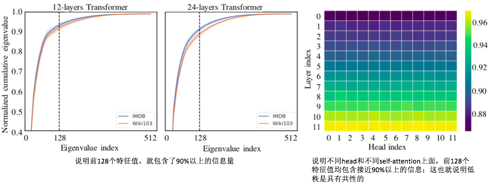

# Linformer: Self-Attention with Linear Complexity

### 摘要

Large transformer models have shown extraordinary success in achieving state-of- the-art results in many natural language processing applications. However, training and deploying these models can be prohibitively costly for long sequences, as the standard self-attention mechanism of the Transformer uses $O(n^2)$ time and space with respect to sequence length. In this paper, we demonstrate that the self attention mechanism can be approximated by a low-rank matrix. We further exploit this finding to propose a new self-attention mechanism, which reduces the overall self-attention complexity from $O(n^2)$ to $O(n)$ in both time and space. The resulting linear transformer, the *Linformer*, performs on par with standard Transformer models, while being much more memory- and time-efficient.

### 动机or创新点

解决的问题：self-attention模块的计算量和存储都在$O(n^2)$的级别（其中的$n$代表输入的长度，这篇文章希望将两者都降到$O(n)$级别

创新点：

1. 作者通过实验观察到self-attention满足低秩的特点，因此可以先进行降维处理来减少计算量和存储量

### 实现细节

#### 1. 低秩现象-实验观察

根据实验观察，可以采用下面的结构对原始self-attention进行等价：

> 具体的数学证明：后续推导了再来补充

从而attention的计算量就减少到$O(nk)$的级别了

因此上述结构转换为网络就如下图所示：

由于上述结构引入了Projection（其实就是FC），虽然参数量不是很多，但是也还比较多，因此作者进一步做了下述一些实验：

- head-wise sharing：每个layer里面的各个head共享projection E和projection F
- Key-value sharing：在head-wise sharing的基础上，令E和F相同
- Layer-wise sharing：每个layer之间的E和F均相同

### 实验结果

- 可以发现，基本上和原始结构性能相近，甚至更好
- 运算速度方面也有很大的提升

### 总结

- 这篇文章最大的亮点，其实在于证明部分（233，后续补充）
- self-attention低秩这个特点，在很多情况下都是能观察到的，例如attention-map稀疏的现象

