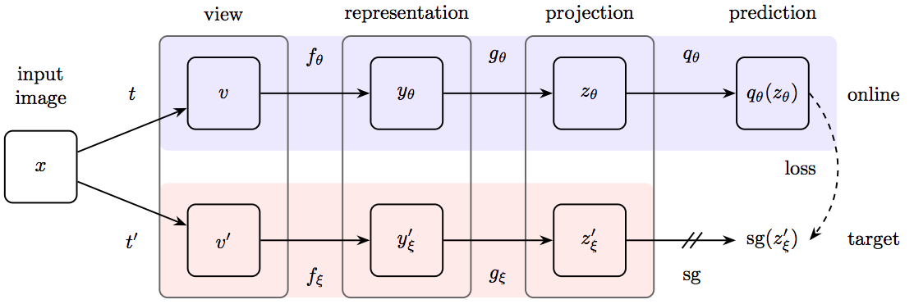
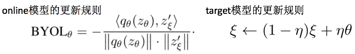
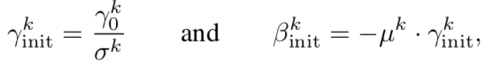
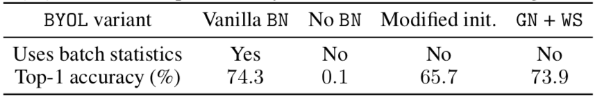
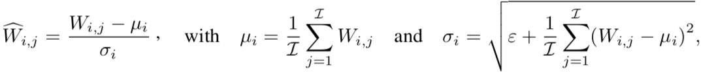

# BOYL works even without batch statistics

### 摘要

Bootstrap Your Own Latent (BYOL) is a self-supervised learning approach for image representation. From an augmented view of an image, BYOL trains an online network to predict a target network representation of a different augmented view of the same image. Unlike contrastive methods, BYOL does not explicitly use a repulsion term built from *negative pairs* in its training objective. Yet, it avoids collapse to a trivial, constant representation. Thus, it has recently been hypothesized that batch normalization (BN) is critical to prevent collapse in BYOL. Indeed, BN flows gradients across batch elements, and could leak information about negative views in the batch, which could act as an implicit negative (contrastive) term. However, we experimentally show that replacing BN with a batch-independent normalization scheme (namely, a combination of group normalization and weight standardization) achieves performance comparable to vanilla BYOL (73.9% vs. 74.3% top-1 accuracy under the linear evaluation protocol on ImageNet with ResNet-50). Our finding disproves the hypothesis that the use of batch statistics is a crucial ingredient for BYOL to learn useful representations.

### 动机&创新点

这篇文章主要**反驳**了下述两个关于为何BYOL能有效的猜测（请注意是反驳下述猜想哦）：

1. BYOL needs BN because BN provides an implicit negative term required to avoid collapse. （BYOL不会陷入collapse是因为BN隐含了负样本的统计信息）：作者认为BN更大的作用是修正了improper initialization，而不是蕴含负样本的统计信息
2. BYOL cannot achieve competitive performance without the implicit contrastive effect provided by batch statistics. （如果没有batch的统计信息，BYOL无法获得好的性能）：作者采用GN+WS也能过取得相近的性能

### 实现细节

#### 1. 先来简单回顾下BYOL的思想

- 其中的sg代表stop-gradient：即下面的target的参数是不利用损失函数进行反向传播更新的

关于online部分的更新采用下述损失函数形式：

- 这篇大家觉得"魔幻"的地方就是没有显性地加入任何负样本

#### 2. 反驳1: BYOL needs BN because BN provides an implicit negative term required to avoid collapse?

这个假设真的对吗？先看下表中的实验，从表格来看，BN似乎真的如上述所说"避免了collapse"（collapse你可以理解为不同类混杂在了一起，区分不开）

- LN是指layer normalization（和batch维度无关）

但是！BN避免collapse的原因真的是因为统计信息吗（蕴涵了负样本的信息吗）？这篇文章作者认为BN的作用是**补偿烂的初始化**（compensate for improper initialization），为了验证自己的观点，作者设计了下述实验：先通过一次前行传播统计获得$\sigma^k$和$\mu^k$（这里的$k$代表不同的层），然后设定下述两个参数作为可学的参数：

- 其中$\gamma_0^k$除了每个residual-block的最后一层设置为0，其他的都设置为1；这里只是初始化一次，后续都是利用梯度更新进行更新学习：主要的作用就是避免烂的初始化（即对输入做一次缩放和偏移：$y=\gamma*x+\beta$）

这样就完全没有用到统计信息，此时也能过获得还不错的性能（性能也有60+，说明没有出现collapse的情况）

结论：不要BN，只需对初始化进行修正也能取得不错的性能（即正确的初始化非常重要）

#### 3. 反驳2: BYOL cannot achieve competitive performance without the implicit contrastive effect provided by batch statistics

作者利用weight standardization (WS)+Group Normalization (GN)也能够取得相近的性能！

其中weight standardization就是对卷积和全连接层的特征进行归一化：

总之一句话：上述两个操作都没有用到Batch的信息

### 结论

1. BYOL里面的BN并不是不可或缺的，是可以替换的：这就将之前大家的猜测又打了个稀烂
2. 感觉这篇文章揭露了一个情况：只要起步（初始化）不要太差，总会朝着好的方向进发