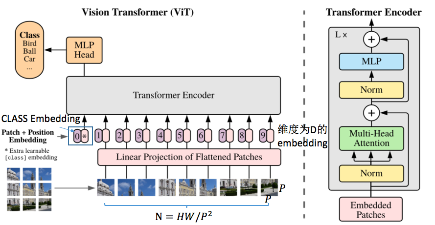
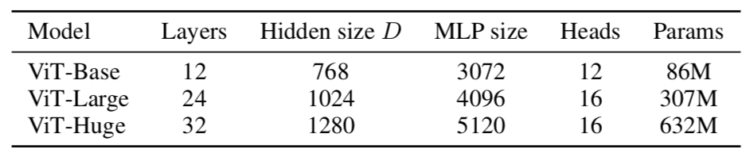
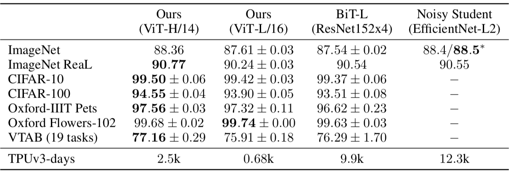

# An Image is Worth 16x16 Words: Transformers for Image Recognition at Scale

### 摘要

While the Transformer architecture has become the de-facto standard for natural language processing tasks, its applications to computer vision remain limited. In vision, attention is either applied in conjunction with convolutional networks, or used to replace certain components of convolutional networks while keeping their overall structure in place. We show that this reliance on CNNs is not necessary and a pure transformer can perform very well on image classification tasks when applied directly to sequences of image patches. When pre-trained on large amounts of data and transferred to multiple recognition benchmarks (ImageNet, CIFAR-100, VTAB, etc.), Vision Transformer attain excellent results compared to state-of-the-art convolutional networks while requiring substantially fewer computational resources to train.

### 创新点&实验现象

- 在图像分类任务上面，完全采用Transformer结构，没有包含任何CNN结构；能够在ImageNet上面取得和基于CNN结构的分类网络（主要是指ResNet）相接近的性能
- Transformer结构在更大的数据集上面进行预训练之后，在其他小的数据集上面进行finetune，能够取得比CNN结构的网络更好的性能（也采用同样更大的数据集预训练，再迁移）

### 实现细节

#### 1. 网络结构

- 如何创造类似NLP里面的token：将图片划分成各个patch（每个patch铺平可以理解为一个token），然后经过FC映射到D维度上面（视为embeding）；剩余的和NLP处理完全一样
- 其中的Position Embedding：相当于标记了一下每个patch，他们属于原始图像的空间位置（可以直接采用one-hot的形式）
- 其中CLASS Embedding存在：在Transformer结构里面，输入和输出其实大小都是一样的，而patch不管哪一种形式的输入，对其对应的输出其实没什么影响（毕竟每个都和其他的进行attention处理），因此取哪个位置似乎都不太合理，额外一个class embedding来指示具体采用哪个feature作为最终的分类特征（其实你不想要也可以，可以采用某个postion embedding对应的哪个特征来做，估计性能也是差不多的）

其他一些细节：

1. 如何在下游分类任务finetune：将上面那个黄色MLP-Head里面的fc换一下然后再finetune就完事了（为了满足新任务的分类数目）
2. 一般采用更大的分辨率finetune性能会更好：直接将大分辨率的也按照$P\times P$的大小取patch，只是最终的N变大了，但是Transformer不受这个影响，所以没啥问题

作者这里采用的三个网络结构如下所示：

- 其中Layers就是Transformer Encoder的数量，Hidden Size就是Embedding的数量，MLP size指的是Transformer Encoder里面的MLP中间特征大小（两层FC），Heads指的是Multi-Head的数目

### 实验结果

1. JFT300M训练的结果，在下述数据集上面finetune的性能

### 结论

1. Transformer大法好啊！！！！！
2. Transformer的优势在于，好像见不到这个模型的“极限”在哪里，在越大的数据集上训，在子任务上面的泛化基本上就是厉害炸了，尤其是few-shot任务
3. 这篇论文在附录里面放了非常多的实验结果，以及各种训练对比，GOOGLE真有钱！！！