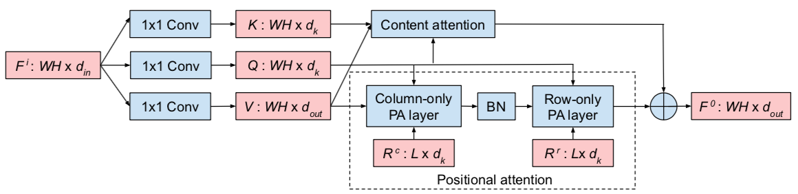

# Global Self-Attention Networks for Image Recognition

### 摘要

Recently, a series of works in computer vision have shown promising results on various image and video understanding tasks using self-attention. However, due to the quadratic computational and memory complexities of self-attention, these works either apply attention only to low-resolution feature maps in later stages of a deep network or restrict the receptive field of attention in each layer to a small local region. To overcome these limitations, this work introduces a new global self-attention module, referred to as the GSA module, which is efficient enough to serve as the backbone component of a deep network. This module consists of two parallel layers: a content attention layer that attends to pixels based only on their content and a positional attention layer that attends to pixels based on their spatial locations. The output of this module is the sum of the outputs of the two layers. Based on the proposed GSA module, we introduce new standalone global attention-based deep networks that use GSA modules instead of convolutions to model pixel interactions. Due to the global extent of the proposed GSA module, a GSA network has the ability to model long-range pixel interactions throughout the network. Our experimental results show that GSA networks outperform the corresponding convolution-based networks significantly on the CIFAR-100 and ImageNet datasets while using less parameters and computations. The proposed GSA networks also outperform various existing attention-based networks on the ImageNet dataset.

### 创新点

- 也是一篇尽可能多用self-attention的文章
- 将self-attention的时间和空间复杂度从$O(N^2)$降到$O(NlogN)$（但具体采用的方式应该都是来自其他文章，做了把融合）
- 在分类任务上取得不错的性能

### 实现细节

这篇文章的核心是GSA模块（Global Self-Attention Module）：主要由content attention和position attention构成

#### 1. GSA模块

Content Attetnion模块：

- 其中的$\rho$代表softmax操作
- 原始的self-attention是采用：$softmax(QK^T/\sqrt{d})V$，而这里其实和原始的没有数学上的对等关系了（这么做相当于交换了矩阵的乘法顺序来减少计算量，但这里数学上不等价）—具体为什么可行估计得看其他论文了
- 这么做的可以将计算量和存储减少为$O(N)$

Position attention模块：

每一个输出点的信息如下图所示

#### 2. GSA网络

就是将ResNet里面`3x3`卷积的部分全部替换成上述GSA模块，然后涉及到下采样的采用pool来实现

### 3. 实验结果

- 可以看到采用GSA模块替换CNN模块，速度更快，性能更好，所需参数量更少
- 但同时也可看到在小网络上面速度影响较大

一些其他蒸馏实验

